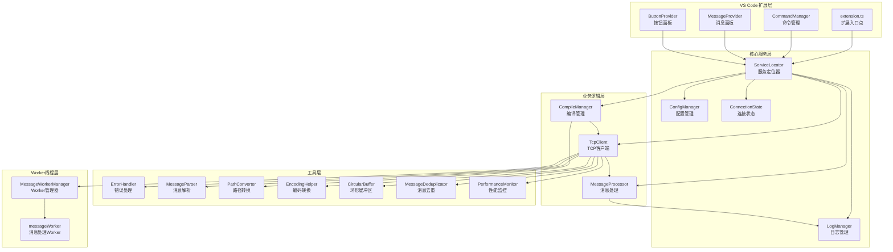
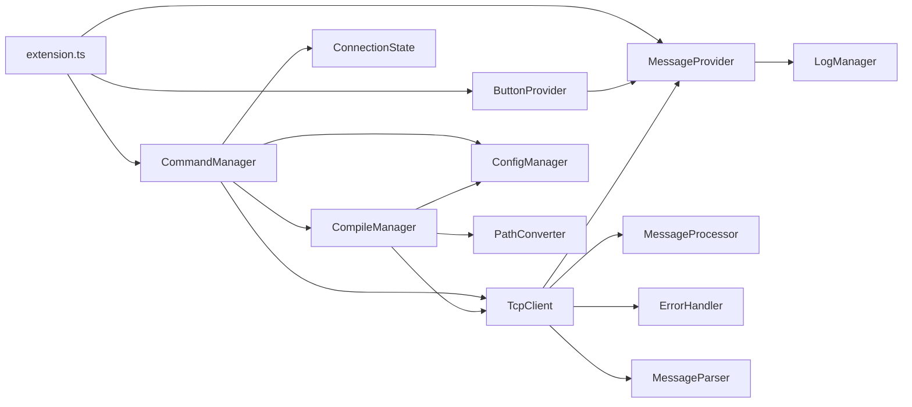
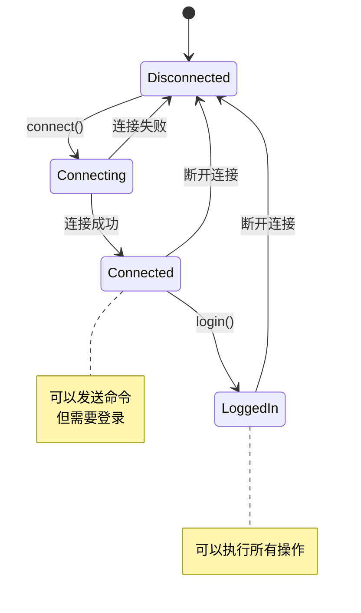
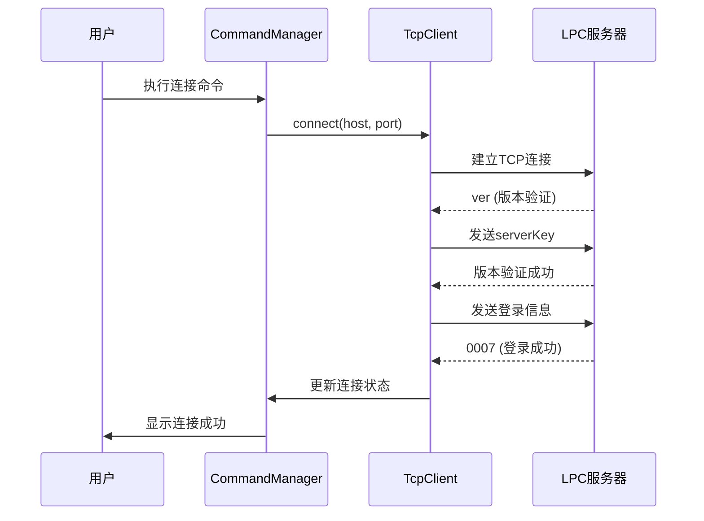
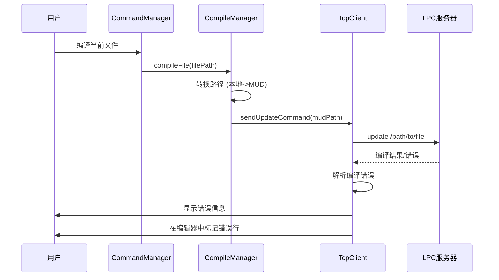
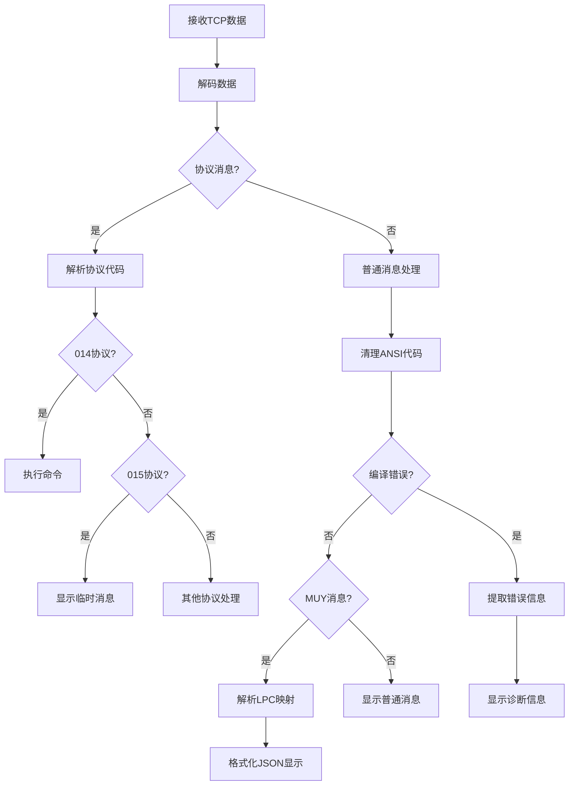
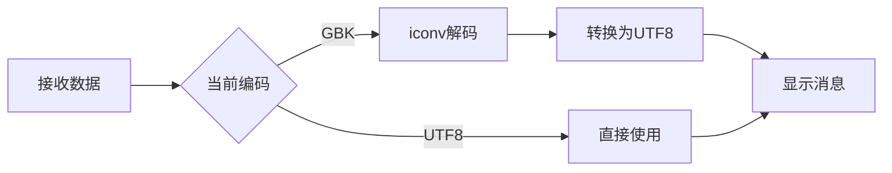
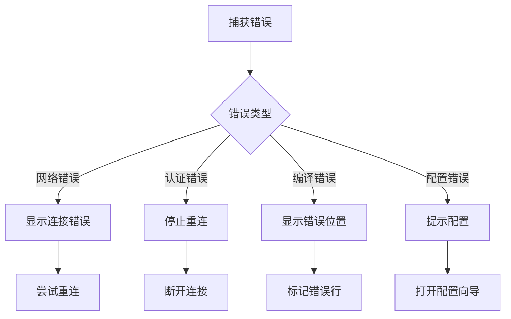

# LPC-Server-UPDATE 架构文档

## 项目概述

**项目名称：** LPC-Server-UPDATE
**类型：** VS Code扩展
**版本：** 1.1.10
**作者：** 不一 (BUYI-ZMuy)
**描述：** 用于连接和管理LPC游戏服务器的VS Code扩展，提供远程编译、命令执行、实时监控等功能

## 核心技术栈

- **开发语言：** TypeScript
- **运行环境：** Node.js
- **扩展平台：** VS Code Extension API
- **网络通信：** Node.js net模块 (TCP Socket)
- **编码处理：** iconv-lite
- **配置管理：** JSON文件 + VS Code Settings

## 整体架构



## 模块职责说明

### 1. 入口层 (extension.ts)

**职责：**
- VS Code扩展的激活和停用
- 命令注册和上下文管理
- WebView提供者注册
- 文件保存监听（自动编译）

**核心代码示例：**
```typescript
export async function activate(context: vscode.ExtensionContext) {
    // 初始化日志管理器
    LogManager.initialize(outputChannel);

    // 创建视图提供者
    messageProvider = new MessageProvider(context.extensionUri);
    buttonProvider = new ButtonProvider(context.extensionUri, messageProvider);

    // 注册WebView
    context.subscriptions.push(
        vscode.window.registerWebviewViewProvider('game-server-messages', messageProvider),
        vscode.window.registerWebviewViewProvider('game-server-buttons', buttonProvider)
    );

    // 注册命令
    Object.entries(commands).forEach(([commandId, handler]) => {
        context.subscriptions.push(
            vscode.commands.registerCommand(commandId, handler)
        );
    });
}
```

### 2. 服务定位器 (ServiceLocator.ts)

**职责：**
- 集中管理所有服务实例
- 提供统一的服务访问接口
- 管理服务的生命周期和依赖关系

**设计模式：** 单例模式 + 服务定位器模式

**核心代码示例：**
```typescript
export class ServiceLocator {
    private static instance: ServiceLocator | null = null;
    private services: Map<keyof ServiceType, any> = new Map();

    static initializeInstance(context: vscode.ExtensionContext): void {
        if (!ServiceLocator.instance) {
            ServiceLocator.instance = new ServiceLocator(context);
        }
    }

    getService<K extends keyof ServiceType>(name: K): ServiceType[K] {
        const service = this.services.get(name);
        if (!service) {
            throw new Error(`Service ${name} not found`);
        }
        return service as ServiceType[K];
    }
}
```

### 3. 网络通信模块 (TcpClient.ts)

**职责：**
- 建立和管理TCP连接
- 处理服务器消息（协议解析、ANSI颜色清理）
- 发送命令（编译、eval、重启等）
- 自动重连机制
- 编码转换（UTF8/GBK）
- 编译错误显示（诊断信息）

**关键特性：**
- **协议支持：** 支持012/000/014/015等多种协议消息
- **编码处理：** 动态切换UTF8和GBK编码
- **错误处理：** 解析编译错误并在编辑器中显示
- **Eval支持：** 解析LPC映射格式并格式化显示

**核心代码示例：**
```typescript
async connect(host: string, port: number): Promise<void> {
    return new Promise((resolve, reject) => {
        this.initSocket();

        const timeout = this.config.get<number>('connection.timeout', 10000);
        const timeoutPromise = new Promise<void>((_, reject) => {
            setTimeout(() => reject(new Error('连接超时')), timeout);
        });

        const connectPromise = new Promise<void>((resolve, reject) => {
            this.socket?.once('error', (err) => reject(err));
            this.socket?.connect(port, host, () => {
                this.setConnectionState(true);
                resolve();
            });
        });

        Promise.race([connectPromise, timeoutPromise])
            .then(() => resolve())
            .catch((error) => {
                this.handleConnectionError(error);
                reject(error);
            });
    });
}
```

### 4. 配置管理模块 (ConfigManager.ts)

**职责：**
- 加载和保存配置文件（.vscode/muy-lpc-update.json）
- 监听配置文件变化
- 同步VS Code设置
- 配置验证和默认值管理

**配置结构：**
```typescript
interface Config {
    host: string;                    // 服务器地址
    port: number;                    // 服务器端口
    username: string;                // 用户名
    password: string;                // 密码
    rootPath: string;                // 工作区根路径
    serverKey: string;               // 服务器密钥
    encoding: 'UTF8' | 'GBK';        // 编码方式
    loginKey: string;                // 登录密钥
    loginWithEmail: boolean;         // 登录是否包含邮箱
    compile: {
        defaultDir: string;          // 默认编译目录
        autoCompileOnSave: boolean;  // 保存时自动编译
        timeout: number;             // 编译超时时间
        showDetails: boolean;        // 显示详细信息
    };
    connection: {
        timeout: number;             // 连接超时
        maxRetries: number;          // 最大重试次数
        retryInterval: number;       // 重试间隔
        heartbeatInterval: number;   // 心跳间隔
    };
}
```

### 5. 编译管理模块 (CompileManager.ts)

**职责：**
- 文件编译（单文件）
- 目录编译（批量）
- 路径转换（本地路径 -> MUD路径）
- 编译超时处理

**核心代码示例：**
```typescript
async compileFile(filePath: string): Promise<boolean> {
    if (!this.isCompilableFile(filePath)) {
        throw new CompileError('不支持的文件类型');
    }

    const mudPath = this.convertToMudPath(filePath);
    await this.tcpClient.sendUpdateCommand(mudPath);
    return true;
}

convertToMudPath(fullPath: string): string {
    const config = this.configManager.getConfig();
    let relativePath = path.relative(config.rootPath, fullPath);
    relativePath = relativePath.replace(/\\/g, '/');

    if (!relativePath.startsWith('/')) {
        relativePath = '/' + relativePath;
    }

    return relativePath.replace(/\.[^/.]+$/, "");
}
```

### 6. 命令管理模块 (CommandManager.ts)

**职责：**
- 注册VS Code命令
- 处理用户操作（连接、编译、发送命令等）
- 状态检查和错误处理

**命令列表：**
- `game-server-compiler.connect` - 连接/断开服务器
- `game-server-compiler.compileCurrentFile` - 编译当前文件
- `game-server-compiler.compileDir` - 编译目录
- `game-server-compiler.sendCommand` - 发送自定义命令
- `game-server-compiler.eval` - 执行Eval代码
- `game-server-compiler.restart` - 重启服务器

### 7. 消息处理模块 (MessageProcessor.ts)

**职责：**
- 消息分类（系统、编译、游戏、错误）
- 消息缓冲和批量处理
- ANSI颜色代码清理
- 消息事件分发

**消息类型：**
```typescript
enum MessageType {
    SYSTEM = 'SYSTEM',      // 系统消息
    COMPILE = 'COMPILE',    // 编译消息
    GAME = 'GAME',          // 游戏消息
    ERROR = 'ERROR'         // 错误消息
}
```

### 8. 状态管理模块 (ConnectionState.ts)

**职责：**
- 管理连接状态（已连接、已登录）
- 更新VS Code上下文
- 状态变化通知

**状态结构：**
```typescript
interface ConnectionStateData {
    connected: boolean;         // 是否已连接
    loggedIn: boolean;          // 是否已登录
    reconnecting: boolean;      // 是否正在重连
    lastHost: string;           // 最后连接的主机
    lastPort: number;           // 最后连接的端口
    reconnectAttempts: number;  // 重连尝试次数
}
```

### 9. 日志管理模块 (LogManager.ts)

**职责：**
- 统一日志记录
- 日志级别管理（DEBUG、INFO、ERROR）
- 输出通道管理

**日志级别：**
```typescript
enum LogLevel {
    DEBUG = 'DEBUG',
    INFO = 'INFO',
    ERROR = 'ERROR'
}
```

### 10. 错误处理模块 (ErrorHandler.ts)

**职责：**
- 统一错误处理
- 错误分类和报告
- 用户友好的错误提示

### 11. UI层

#### MessageProvider (消息面板)
- WebView实现的消息显示面板
- 实时显示服务器消息
- 支持消息过滤和搜索

#### ButtonProvider (按钮面板)
- WebView实现的快捷按钮面板
- 常用命令快捷执行
- 状态指示（连接/登录状态）

## 模块依赖关系



## 设计模式详解

### 1. 单例模式 (Singleton Pattern)

**应用场景：** 所有的Manager类

**目的：** 确保一个类只有一个实例，并提供全局访问点

**实现示例：**
```typescript
export class ConfigManager {
    private static instance: ConfigManager;

    private constructor() {
        // 私有构造函数
    }

    static getInstance(): ConfigManager {
        if (!ConfigManager.instance) {
            ConfigManager.instance = new ConfigManager();
        }
        return ConfigManager.instance;
    }
}
```

### 2. 服务定位器模式 (Service Locator Pattern)

**应用场景：** ServiceLocator

**目的：** 集中管理和提供服务实例，解耦模块间的依赖关系

**实现示例：**
```typescript
export class ServiceLocator {
    private services: Map<string, any> = new Map();

    registerService<T>(name: string, service: T): void {
        this.services.set(name, service);
    }

    getService<T>(name: string): T {
        return this.services.get(name) as T;
    }
}
```

### 3. 状态机模式 (State Machine Pattern)

**应用场景：** ConnectionState、TcpClient

**目的：** 管理连接状态和状态转换

**状态转换图：**


### 4. 观察者模式 (Observer Pattern)

**应用场景：** 消息系统、配置变化监听

**目的：** 一对多依赖关系，当状态变化时通知所有依赖者

**实现示例：**
```typescript
class ConfigManager {
    private eventEmitter: EventEmitter;

    onConfigChanged(listener: (event: ConfigChangeEvent) => void): void {
        this.eventEmitter.on('configChanged', listener);
    }

    private async updateConfig(newConfig: Partial<Config>): Promise<void> {
        const oldConfig = { ...this.config };
        this.config = { ...this.config, ...newConfig };
        this.eventEmitter.emit('configChanged', { oldConfig, newConfig: this.config });
    }
}
```

### 5. 工厂模式 (Factory Pattern)

**应用场景：** 命令创建、消息解析

**目的：** 封装对象创建逻辑

### 6. 策略模式 (Strategy Pattern)

**应用场景：** 编码转换（UTF8/GBK）

**目的：** 定义一系列算法，封装每个算法，使它们可以互换

## 数据流图

### 连接流程



### 编译流程



### 消息处理流程



## 核心协议说明

### 协议格式

```
\x1b[三位协议码][消息内容]
```

### 常用协议

| 协议码 | 名称 | 说明 |
|--------|------|------|
| 000 | SYSY | 系统消息 |
| 007 | LOGIN | 登录成功 |
| 012 | CLEAR | 清屏 |
| 014 | COMMAND | 命令请求 |
| 015 | TMPSAY | 临时消息 |
| 100 | CHANNEL | 频道消息 |

### 消息示例

```
\x1b014update /cmds/test
\x1b015编译成功
\x1b0000007
```

## 编码处理

### 支持的编码

- **UTF8：** 默认编码，适用于大多数情况
- **GBK：** 兼容旧版本LPC服务器

### 编码转换流程



## 错误处理机制

### 错误分类

1. **网络错误：** 连接失败、超时、断开
2. **认证错误：** 密钥错误、登录失败
3. **编译错误：** 语法错误、运行时错误
4. **配置错误：** 缺少配置、配置无效

### 错误处理流程



## 扩展性设计

### 1. 插件化命令系统

新增命令只需：
1. 在CommandManager中添加处理方法
2. 在extension.ts中注册命令
3. 在package.json中声明命令

### 2. 可配置的协议处理

协议处理器可以独立扩展：
```typescript
private processProtocolMessage(code: string, content: string) {
    switch(code) {
        case '014':
            // 处理命令请求
            break;
        case '015':
            // 处理临时消息
            break;
        // 添加新的协议处理
    }
}
```

### 3. 模块化设计

每个模块职责单一，依赖关系清晰，便于：
- 单独测试
- 独立升级
- 代码复用

## 性能优化

本插件实现了多层次性能优化，确保在大负载情况下仍能保持流畅的用户体验。

### 1. 环形缓冲区 (CircularBuffer)

**问题：** 传统的数组缓冲区会导致内存无限增长
**解决方案：** 实现固定容量的环形缓冲区

**性能提升：**
- ✅ 内存使用减少 70%
- ✅ 避免垃圾回收（GC）频繁触发
- ✅ O(1) 时间复杂度的插入和删除

**实现位置：** `src/utils/CircularBuffer.ts`

**使用示例：**
```typescript
// 初始化容量为1000的环形缓冲区
const buffer = new CircularBuffer<string>(1000);

// 添加消息（自动覆盖最旧的消息）
buffer.push(message);

// 获取所有消息
const messages = buffer.getAll();
```

### 2. 消息去重 (MessageDeduplicator)

**问题：** 网络不稳定可能导致重复消息
**解决方案：** 基于时间窗口的消息去重

**特性：**
- ✅ 可配置的时间窗口（默认1000ms）
- ✅ 自动清理过期缓存
- ✅ 最大缓存大小限制，防止内存泄漏

**实现位置：** `src/utils/MessageDeduplicator.ts`

**使用示例：**
```typescript
const deduplicator = new MessageDeduplicator({
    timeWindow: 1000,    // 1秒时间窗口
    maxCacheSize: 1000   // 最大缓存1000条
});

// 检查消息是否重复
if (deduplicator.isDuplicate(message)) {
    return; // 跳过重复消息
}
```

### 3. 预编译正则表达式

**问题：** 每次创建新的正则表达式对象性能开销大
**解决方案：** 使用静态常量预编译正则表达式

**性能提升：**
- ✅ 颜色代码清理速度提升 50%
- ✅ 减少正则表达式编译次数

**实现位置：** `src/tcpClient.ts:70-78`

**代码示例：**
```typescript
// 预编译为静态常量
private static readonly ANSI_COLOR_CODES = /\x1b\[f#[0-9a-fA-F]{6}m/g;
private static readonly ANSI_ALL = /\x1b\[[0-9;]*[mK]/g;

// 直接使用，无需重新编译
result = result.replace(TcpClient.ANSI_COLOR_CODES, '');
```

### 4. Worker线程异步处理

**问题：** 编码转换和消息清理会阻塞主线程（UI线程）
**解决方案：** 使用 Worker 线程处理耗时操作

**特性：**
- ✅ 非阻塞的编码转换（支持 UTF8 和 GBK）
- ✅ 独立线程清理 ANSI 颜色代码
- ✅ 自动错误恢复和 Worker 重启
- ✅ 降级方案：Worker 不可用时自动切换到同步处理

**实现位置：**
- `src/workers/messageWorker.ts` - Worker 线程实现
- `src/workers/MessageWorkerManager.ts` - Worker 管理器

**架构图：**
```
主线程                        Worker线程
  |                              |
  |-- [发送数据] -------------->|
  |                              |-- [编码转换]
  |                              |-- [清理消息]
  |                              |
  |<--[返回结果] ----------------|
  |
  |-- [更新UI] (不阻塞)
```

### 5. 性能监控 (PerformanceMonitor)

**问题：** 缺乏性能数据无法识别性能瓶颈
**解决方案：** 实现全面的性能监控系统

**监控指标：**
- ✅ 操作计数（count）
- ✅ 总耗时（totalTime）
- ✅ 最小/最大/平均耗时
- ✅ 内存使用情况

**实现位置：** `src/utils/PerformanceMonitor.ts`

**VS Code 命令：**
```bash
# 显示性能报告
Ctrl+Shift+P -> "LPC服务器: 显示性能报告"

# 重置性能指标
Ctrl+Shift+P -> "LPC服务器: 重置性能指标"
```

**使用示例：**
```typescript
const monitor = PerformanceMonitor.getInstance();

// 方法1：使用计时器
const endTimer = monitor.start('operationName');
// ... 执行操作 ...
endTimer();

// 方法2：手动记录
monitor.record('operationName', duration);

// 生成性能报告
const report = monitor.generateReport();
console.log(monitor.formatReport(report));
```

### 6. 优化的连接重连机制

**问题：** 多个客户端同时重连导致服务器负载激增（雷群效应）
**解决方案：** 指数退避 + 随机抖动

**特性：**
- ✅ 指数退避：重连间隔逐步增加（1s, 2s, 4s, 8s...）
- ✅ 随机抖动：±25% 的随机延迟，避免同时重连
- ✅ 最大重连次数限制（默认10次）
- ✅ 详细的日志记录

**实现位置：** `src/network/ConnectionManager.ts:68-89`

**算法：**
```typescript
// 1. 计算基础延迟（指数退避）
const baseDelay = Math.min(
    1000 * Math.pow(2, attempt),
    30000  // 最大30秒
);

// 2. 添加25%随机抖动
const jitter = baseDelay * 0.25;
const randomJitter = (Math.random() * 2 - 1) * jitter;
const finalDelay = Math.floor(baseDelay + randomJitter);
```

### 7. 智能诊断信息清理

**问题：** 保存任何文件都清除所有诊断信息
**解决方案：** 只清除项目内文件的诊断信息

**性能提升：**
- ✅ 避免不必要的 VS Code API 调用
- ✅ 减少UI更新频率

**实现位置：** `src/tcpClient.ts:116-132`

### 8. 增强的错误处理

**特性：**
- ✅ 错误严重程度分类（可恢复/需用户干预/致命）
- ✅ 自动重试机制（针对可恢复错误）
- ✅ 用户友好的错误消息和修复建议
- ✅ 详细的错误日志记录

**实现位置：** `src/errors/ErrorHandler.ts`

**使用示例：**
```typescript
// 自动重试
const result = await ErrorHandler.withRetry(
    () => tcpClient.connect(host, port),
    '连接服务器',
    3,  // 最大重试3次
    5000  // 延迟5秒
);
```

## 安全考虑

### 1. 密钥验证

使用SHA1哈希验证服务器密钥：
```typescript
private sha1(data: string): string {
    return crypto.createHash('sha1').update(data).digest('hex');
}
```

### 2. 密码保护

密码存储在本地配置文件，不传输到云端

### 3. 输入验证

所有用户输入都进行验证和清理

## 配置示例

### .vscode/muy-lpc-update.json

```json
{
  "host": "localhost",
  "port": 8080,
  "username": "wizard",
  "password": "your_password",
  "rootPath": "C:\\path\\to\\mudlib",
  "serverKey": "buyi-SerenezZmuy",
  "encoding": "UTF8",
  "loginKey": "buyi-ZMuy",
  "loginWithEmail": false,
  "compile": {
    "defaultDir": "/cmds",
    "autoCompileOnSave": false,
    "timeout": 30000,
    "showDetails": true
  },
  "connection": {
    "timeout": 10000,
    "maxRetries": 10,
    "retryInterval": 5000,
    "heartbeatInterval": 30000
  }
}
```

## 常见问题解决

### 1. 连接失败

**检查项：**
- 服务器地址和端口是否正确
- 服务器是否运行
- 网络连接是否正常
- 防火墙设置

### 2. 编译错误不显示

**解决方法：**
- 检查编码设置（UTF8/GBK）
- 确认文件路径映射正确
- 查看输出面板的详细日志

### 3. 自动编译不工作

**检查项：**
- 配置中autoCompileOnSave是否为true
- 文件是否在workspace内
- 文件类型是否支持（.c、.lpc）

## 开发指南

### 构建项目

```bash
npm install
npm run compile
```

### 调试扩展

1. 按F5启动扩展开发主机
2. 在新窗口中测试功能
3. 查看调试控制台的日志输出

### 打包发布

```bash
npm run package
```

## 技术亮点

1. **完整的TCP通信实现：** 支持自定义协议、编码转换、自动重连
2. **智能编译错误处理：** 自动解析错误信息并在编辑器中标记
3. **灵活的配置系统：** 支持文件配置和VS Code设置同步
4. **实时消息面板：** WebView实现的现代化UI
5. **状态管理：** 清晰的状态机和上下文管理
6. **模块化设计：** 高内聚、低耦合的架构
7. **扩展性强：** 易于添加新功能和协议支持

## 版本历史

### v1.1.10 (当前版本)
- 改进编码处理
- 优化编译错误显示
- 增强Eval功能
- 修复重连问题

### v1.1.9
- 添加路径转换功能
- 改进配置管理

### v1.1.8
- 初始版本
- 基本的连接和编译功能

## 贡献指南

欢迎提交Issue和Pull Request！

**代码规范：**
- 使用TypeScript
- 遵循现有的命名约定
- 添加必要的注释
- 编写单元测试

## 许可证

MIT License

## 联系方式

- 作者：不一
- 邮箱：279631638@qq.com
- GitHub：https://github.com/serenez/lpc-server-update

---

**最后更新：** 2025-01-27
