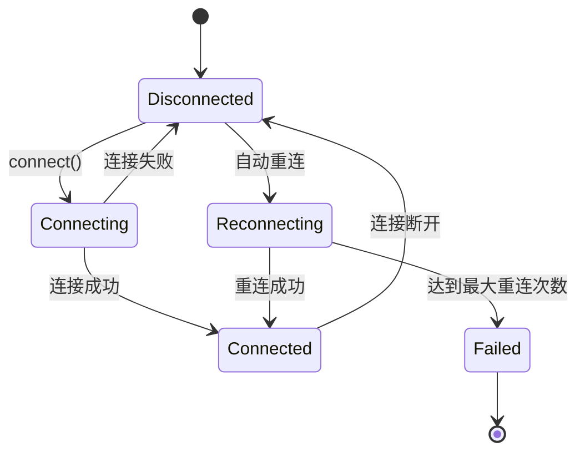
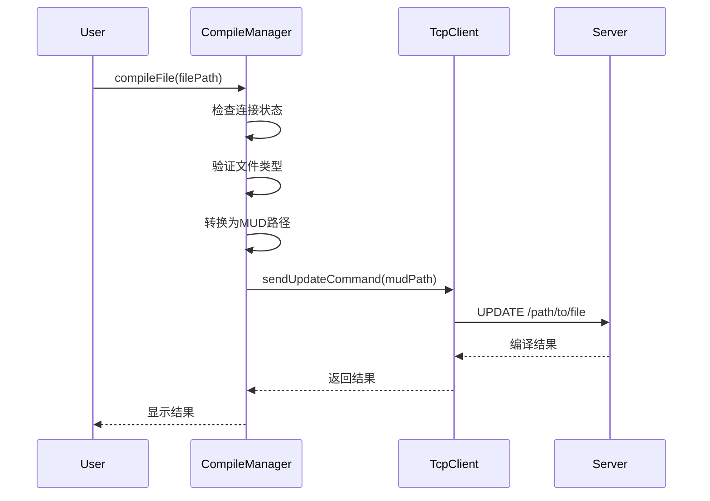
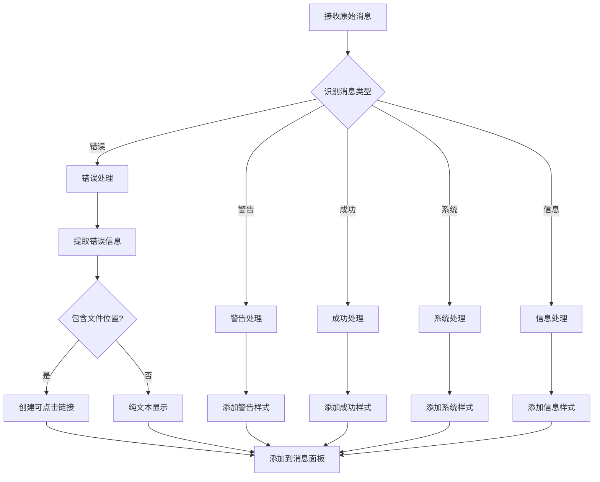
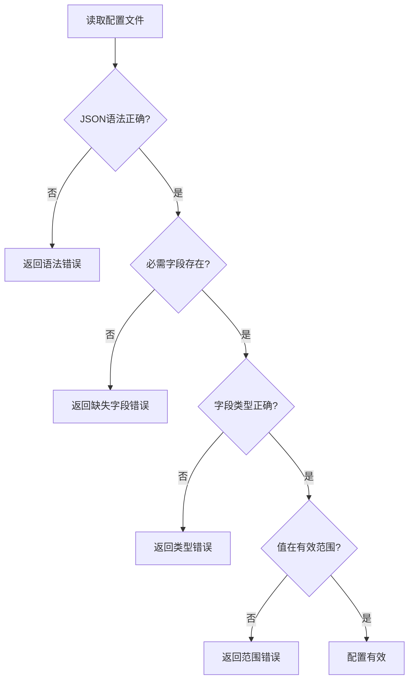
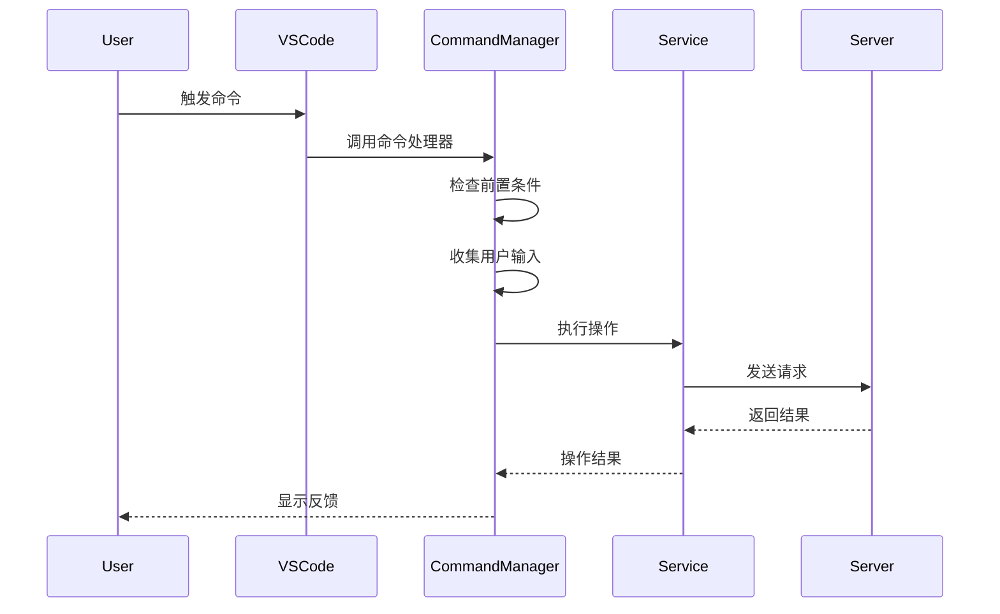
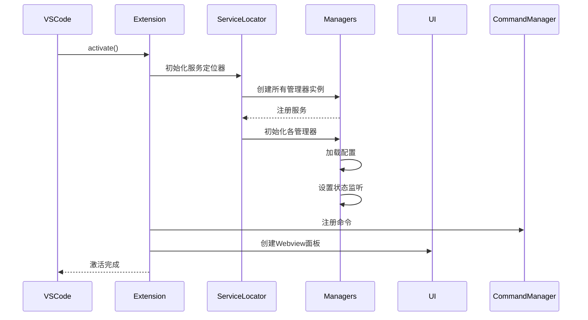
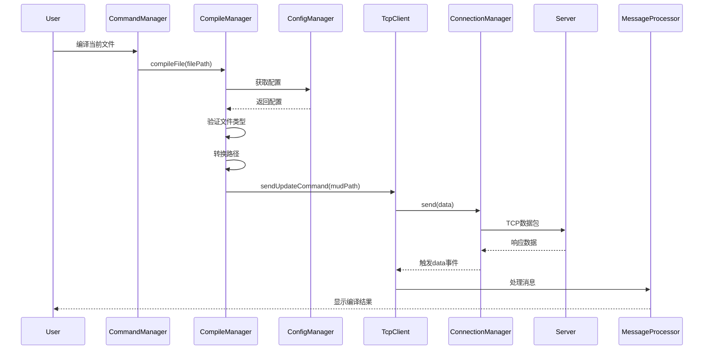
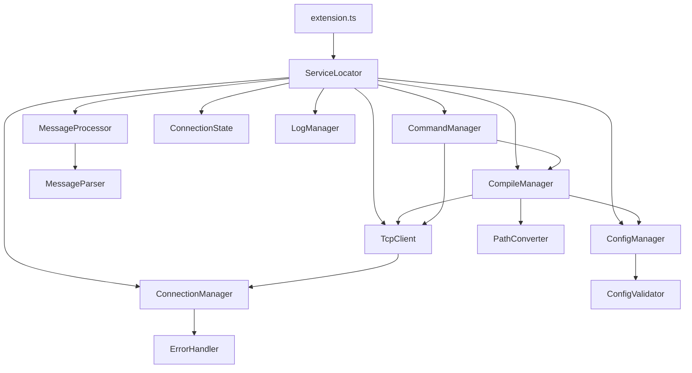
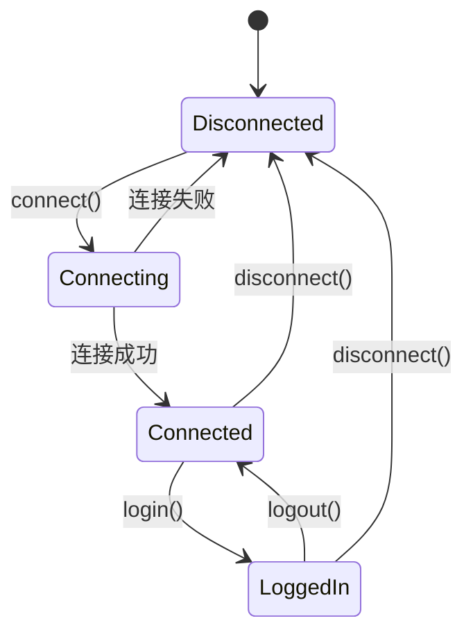

# LPC-Server-UPDATE 模块详细设计文档

## 文档概述

本文档详细说明LPC-Server-UPDATE VS Code扩展的各个核心模块的设计，包括模块职责、接口定义、状态机、关键算法以及模块间的交互关系。

---

## 目录

- [1. ConnectionManager - 连接管理器](#1-connectionmanager---连接管理器)
- [2. CompileManager - 编译管理器](#2-compilemanager---编译管理器)
- [3. MessageProcessor - 消息处理器](#3-messageprocessor---消息处理器)
- [4. ConfigManager - 配置管理器](#4-configmanager---配置管理器)
- [5. CommandManager - 命令管理器](#5-commandmanager---命令管理器)
- [6. 模块交互流程](#6-模块交互流程)

---

## 1. ConnectionManager - 连接管理器

### 1.1 模块职责

ConnectionManager负责维护与LPC游戏服务器的TCP连接，提供可靠的网络通信基础。

**核心职责：**
- 建立和维护TCP Socket连接
- 实现自动重连机制（指数退避算法）
- 数据的发送和接收
- 连接状态事件通知
- 连接超时处理

### 1.2 公共接口

```typescript
class ConnectionManager {
  // 建立连接
  connect(host: string, port: number): Promise<void>

  // 发送数据
  send(data: Buffer): Promise<void>

  // 事件监听
  on(event: string, listener: (...args: any[]) => void): void

  // 资源清理
  dispose(): void
}
```

**事件类型：**
- `connected` - 连接成功建立
- `disconnected` - 连接断开
- `data` - 收到数据
- `error` - 发生错误

### 1.3 重连机制（指数退避算法）



**关键参数：**
- `maxReconnectAttempts`: 10（最大重连次数）
- `initialReconnectDelay`: 1000ms（初始重连延迟）
- `maxReconnectDelay`: 30000ms（最大重连延迟）

**重连延迟计算公式：**
```typescript
delay = min(initialDelay * 2^attempts, maxDelay)
```

### 1.4 关键算法

**数据发送算法：**
```typescript
send(data: Buffer): Promise<void> {
  return new Promise((resolve, reject) => {
    if (!socket?.writable) {
      reject(new Error('连接未建立'))
      return
    }
    socket.write(data, (error) => {
      error ? reject(error) : resolve()
    })
  })
}
```

---

## 2. CompileManager - 编译管理器

### 2.1 模块职责

CompileManager负责处理LPC代码的编译操作，支持单文件和目录级别的编译。

**核心职责：**
- 验证文件类型是否可编译
- 路径转换（本地路径 → MUD路径）
- 发送编译命令到服务器
- 编译超时控制
- 编译结果反馈

### 2.2 公共接口

```typescript
class CompileManager {
  // 检查文件是否可编译
  isCompilableFile(filePath: string): boolean

  // 转换路径格式
  convertToMudPath(fullPath: string): string

  // 编译单个文件
  compileFile(filePath: string): Promise<boolean>

  // 编译整个目录
  compileDirectory(dirPath: string): Promise<boolean>
}
```

### 2.3 编译流程



### 2.4 关键算法

**路径转换算法：**
```typescript
convertToMudPath(fullPath: string): string {
  // 1. 计算相对路径
  let relativePath = path.relative(config.rootPath, fullPath)

  // 2. 统一路径分隔符
  relativePath = relativePath.replace(/\\/g, '/')

  // 3. 确保以/开头
  if (!relativePath.startsWith('/')) {
    relativePath = '/' + relativePath
  }

  // 4. 移除文件扩展名
  return relativePath.replace(/\.[^/.]+$/, "")
}
```

**超时控制算法：**
```typescript
async compileDirectory(dirPath: string): Promise<boolean> {
  const timeoutPromise = new Promise((_, reject) => {
    setTimeout(() => reject(new CompileError('编译超时')),
                config.compile.timeout)
  })

  const compilePromise = this.tcpClient.sendCustomCommand(
    `updateall ${dirPath}`
  )

  await Promise.race([compilePromise, timeoutPromise])
}
```

---

## 3. MessageProcessor - 消息处理器

### 3.1 模块职责

MessageProcessor负责处理从服务器接收到的所有消息，进行分类、格式化和展示。

**核心职责：**
- 消息分类（系统、错误、警告、信息、成功）
- 消息格式化和高亮
- 消息缓冲和滚动控制
- 错误消息解析和定位
- 消息清理

### 3.2 公共接口

```typescript
class MessageProcessor {
  // 处理接收到的消息
  processMessage(message: string): void

  // 分类消息
  classifyMessage(message: string): MessageType

  // 格式化消息
  formatMessage(message: string, type: MessageType): FormattedMessage

  // 清空消息
  clearMessages(): void
}
```

### 3.3 消息分类规则

| 消息类型 | 识别模式 | 颜色 |
|---------|---------|------|
| 错误 (ERROR) | 包含"错误"、"error"、"编译失败" | #f44336 |
| 警告 (WARNING) | 包含"警告"、"warning" | #ff9800 |
| 成功 (SUCCESS) | 包含"成功"、"编译成功" | #4CAF50 |
| 系统 (SYSTEM) | 包含"系统"、"连接"、"断开" | #9C27B0 |
| 信息 (INFO) | 其他所有消息 | #2196F3 |

### 3.4 消息处理流程



---

## 4. ConfigManager - 配置管理器

### 4.1 模块职责

ConfigManager负责管理扩展的所有配置，包括加载、验证、更新和监听配置变化。

**核心职责：**
- 加载和解析配置文件
- 配置验证
- 提供配置访问接口
- 监听配置文件变化
- 配置热更新

### 4.2 公共接口

```typescript
class ConfigManager {
  // 获取配置对象
  getConfig(): Config

  // 更新配置
  updateConfig(updates: Partial<Config>): Promise<void>

  // 验证配置
  validateConfig(config: any): ValidationResult

  // 重新加载配置
  reloadConfig(): Promise<void>
}
```

### 4.3 配置结构

```typescript
interface Config {
  // 基本连接信息
  host: string
  port: number
  username: string
  password: string

  // 服务器验证
  serverKey: string
  loginKey: string

  // 编码设置
  encoding: 'UTF8' | 'GBK'

  // 编译配置
  compile: {
    autoCompileOnSave: boolean
    defaultDir: string
    timeout: number
    showDetails: boolean
  }

  // 连接配置
  connection: {
    maxRetries: number
    retryInterval: number
    timeout: number
  }

  // 项目路径
  rootPath: string
}
```

### 4.4 配置验证流程



---

## 5. CommandManager - 命令管理器

### 5.1 模块职责

CommandManager负责注册和管理VS Code命令，处理用户交互。

**核心职责：**
- 注册VS Code命令
- 处理命令执行
- 用户输入验证
- 错误处理和反馈
- 命令上下文管理

### 5.2 注册的命令

| 命令ID | 功能 | 上下文条件 |
|--------|------|-----------|
| `game-server-compiler.connect` | 连接/断开服务器 | 总是可用 |
| `game-server-compiler.compileCurrentFile` | 编译当前文件 | 已连接且已登录 |
| `game-server-compiler.compileDir` | 编译目录 | 已连接且已登录 |
| `game-server-compiler.sendCommand` | 发送自定义命令 | 已连接且已登录 |
| `game-server-compiler.eval` | 执行Eval命令 | 已连接且已登录 |
| `game-server-compiler.restart` | 重启服务器 | 已连接且已登录 |

### 5.3 命令执行流程



### 5.4 错误处理模式

所有命令处理器都遵循统一的错误处理模式：

```typescript
private async handleCommand(): Promise<void> {
  try {
    // 1. 记录调试日志
    this.logManager.log('处理命令', LogLevel.DEBUG, 'CommandManager')

    // 2. 检查前置条件
    if (!this.tcpClient.isConnected()) {
      throw new NetworkError('请先连接服务器')
    }

    // 3. 执行核心逻辑
    await this.doSomething()

    // 4. 记录成功日志
    this.logManager.log('命令执行成功', LogLevel.INFO)

  } catch (error) {
    // 5. 记录错误日志
    this.logManager.log(`命令失败: ${error}`, LogLevel.ERROR)

    // 6. 显示用户友好的错误消息
    vscode.window.showErrorMessage(`操作失败: ${error}`)
  }
}
```

---

## 6. 模块交互流程

### 6.1 扩展启动流程



### 6.2 完整编译流程



### 6.3 模块依赖关系



---

## 附录

### A. 模块状态转换

**ConnectionState状态机：**



### B. 错误处理策略

每个模块都遵循统一的错误处理策略：

1. **捕获所有异常** - 使用try-catch包裹所有可能抛出异常的代码
2. **记录错误日志** - 使用LogManager记录详细的错误信息
3. **用户友好提示** - 通过VS Code API显示可理解的错误消息
4. **向上传播** - 对于无法处理的错误，向上层抛出

### C. 性能优化建议

1. **连接复用** - ConnectionManager使用单例模式，避免重复建立连接
2. **消息缓冲** - MessageProcessor使用环形缓冲区限制消息数量
3. **延迟加载** - 按需初始化各个管理器
4. **事件节流** - 对高频事件进行节流处理

---

**文档版本：** 1.0.0
**最后更新：** 2026-01-27
**维护者：** 不一 (BUYI-ZMuy)
